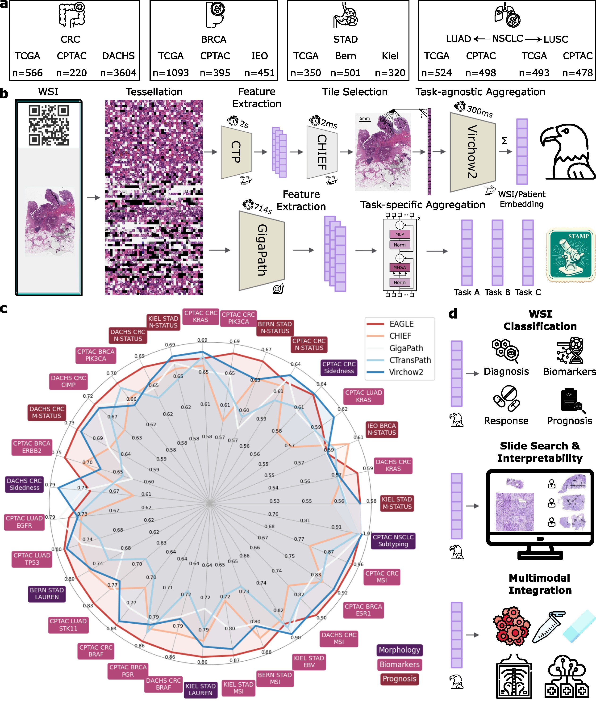

# EAGLE
Efficient Approach for Guided Local Examination in Digital Pathology

[Preprint](https://arxiv.org/abs/2502.13027) | [Cite](#citation)

## Abstract
>Artificial intelligence (AI) has transformed digital pathology by enabling biomarker prediction from high-resolution whole slide images (WSIs). However, current methods are computationally inefficient, processing thousands of redundant tiles per WSI and requiring complex aggregator models. We introduce EAGLE (Efficient Approach for Guided Local Examination), a deep learning framework that emulates pathologists by selectively analyzing informative regions. EAGLE incorporates two foundation models: CHIEF for efficient tile selection and Virchow2 for extracting high-quality features. Benchmarking was conducted against leading slide- and tile-level foundation models across 31 tasks from four cancer types, spanning morphology, biomarker prediction and prognosis. EAGLE outperformed state-of-the-art foundation models by up to 23% and achieved the highest AUROC overall. It processed a slide in 2.27 seconds, reducing computational time by more than 99% compared to existing models. This efficiency enables real-time workflows, allows pathologists to validate all tiles which are used by the model during analysis, and eliminates dependence on high-performance computing, making AI-powered pathology more accessible. By reliably identifying meaningful regions and minimizing artifacts, EAGLE provides robust and interpretable outputs, supporting rapid slide searches, integration into multi-omics pipelines and emerging clinical foundation models.


<p align="center">
    
</p>

## System Requirements

EAGLE has been tested on the following system:

- **Operating System:** Debian GNU/Linux 12 (Bookworm)
- **Kernel Version:** 6.1.0-30-amd64
- **Python Version:** 3.11

### Recommended Hardware
EAGLE can run on both CPU and GPU.

**Suggested hardware for large cohort analysis:**
- **CPU:** 8+ cores
- **RAM:** 64GB
- **GPU:** 12GB VRAM

For smaller test runs (e.g., using the demo dataset), lower specifications may be sufficient.

> **Note:** The demo was tested on a **MacBook Air (M3, 2024)**. It runs in approximately **3 minutes** on a similar device, installation takes a few minutes.
> Full experiments were conducted on the Linux server described above.

## Installation

All dependencies are listed in [requirements.txt](requirements.txt). To install the required packages, run:

```bash
pip install -r requirements.txt
```

## EAGLE Demo

A demo dataset is provided, containing 7 slides from TCGA-CRC.

To run the demo:

```bash
python eagle/main_feature_extraction.py --visualize
```
### Expected Output
- One H5 file per cohort with a 1280-dimensional embedding for each patient (stored under the patient ID).  
- If `--visualize` is specified, thumbnail images with boxes around the selected tiles are generated.

### Data Source & Acknowledgment
The demo dataset includes slides from **The Cancer Genome Atlas (TCGA)** colorectal cancer (TCGA-CRC) cohort. Raw WSIs can be accessed via the **[TCGA Data Portal](https://portal.gdc.cancer.gov/)**.

## EAGLE Feature Extraction

Before extracting EAGLE slide embeddings, please ensure you have completed the following steps:

1. **Extract CTransPath Features at 2 MPP**  
   Use the [STAMP-Benchmark](https://github.com/KatherLab/STAMP-Benchmark) with the following configuration:
   - **Cache Images:** Store in `cache/images`
   - **Tile Features:** Store in `tile_features/2mpp`
   - **Microns:** Set to `448` (with a pixel size of `224`, this results in a 2 MPP magnification)
   - **Normalization:** `false`
   - **Feature Extractor:** `ctp`
   - **Cache:** `true`
   - **Only Feature Extraction:** `false`

2. **Virchow2 Access**  
   - Request access via [Virchow2 on Hugging Face](https://huggingface.co/paige-ai/Virchow2).  
   - Once approved, add your access token to your environment.

3. **CHIEF Model Weights**  
   - Download the CHIEF model weights from the [CHIEF repository](https://github.com/hms-dbmi/CHIEF).  
   - Save the weights to: `model_weights/CHIEF_pretraining.pth`

4. **Prepare the Slide Table**  
   Create a CSV slide table mapping tile features to patient IDs (to account for multiple slides per patient). The CSV must contain the following columns:
   - `PATIENT`: Patient IDs  
   - `FILENAME`: Corresponding `.h5` filename from `tile_features/2mpp`

You can extract the EAGLE slide embeddings using the main extraction script:

```bash
python eagle/main_feature_extraction.py
```

or if you want to inspect the selected toptiles:

```bash
python eagle/main_feature_extraction.py --visualize
```

## Acknowledgements

We thank the authors and developers for their contribution as below.

- [STAMP](https://github.com/KatherLab/STAMP)
- [CHIEF](https://github.com/hms-dbmi/CHIEF)
- [Virchow2](https://huggingface.co/paige-ai/Virchow2)

## Citation

If you find our work useful in your research or if you use parts of this code please consider citing our [preprint](https://arxiv.org/abs/2502.13027):

Neidlinger, P. et al. A deep learning framework for efficient pathology image analysis, _Arxiv_, 2025

```bibtex
@misc{neidlinger2025eagle,
      title={A deep learning framework for efficient pathology image analysis}, 
      author={Peter Neidlinger and Tim Lenz and Sebastian Foersch and Chiara M. L. Loeffler and Jan Clusmann and Marco Gustav and Lawrence A. Shaktah and Rupert Langer and Bastian Dislich and Lisa A. Boardman and Amy J. French and Ellen L. Goode and Andrea Gsur and Stefanie Brezina and Marc J. Gunter and Robert Steinfelder and Hans-Michael Behrens and Christoph Röcken and Tabitha Harrison and Ulrike Peters and Amanda I. Phipps and Giuseppe Curigliano and Nicola Fusco and Antonio Marra and Michael Hoffmeister and Hermann Brenner and Jakob Nikolas Kather},
      year={2025},
      eprint={2502.13027},
      archivePrefix={arXiv},
      primaryClass={cs.CV},
      url={https://arxiv.org/abs/2502.13027}, 
}
```
